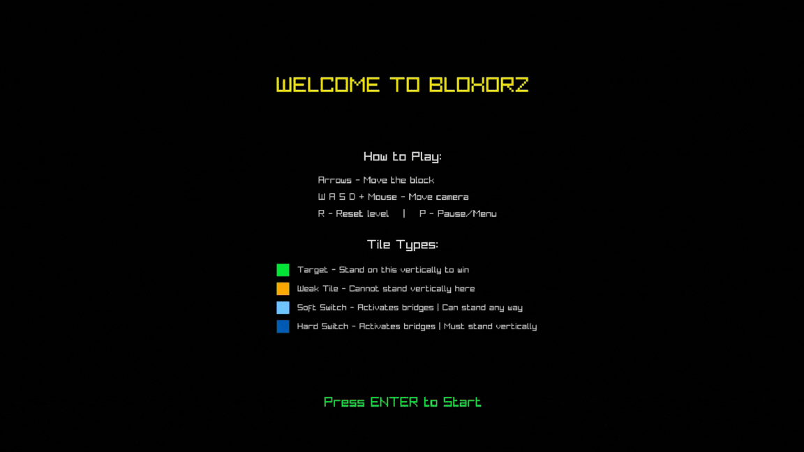

# bloxorz

A puzzle game where you roll a block to reach the target tile. Built with C and Raylib.



## About

Bloxorz is a classic block rolling puzzle game. Your goal is to navigate the rectangular block across various platforms and make it stand upright on the green target tile. The challenge comes from the block's physics, it rolls, flips, and changes orientation as you move.
but if the box go outside the map squares or stand on the orange tile it consider as a fail.
and but what makes the puzzle more challenging is to win with the minimum moves and time.

**Features:**
- 13 challenging levels with progressive difficulty
- Multiple tile types: target tiles, weak tiles, and switches
- Statistics tracking for speedruns (moves and time)

## Controls

- `AROOWS` - Move block
- `W` `A` `S` `D` + Mouse - Camera control
- `R` - Reset level
- `P` - Menu
- `S` - Save stats (after completing all levels)

## Game Rules

**Objective:** Stand the block upright on the green tile.

**Tile Types:**
- Green - Target tile (win condition).
- Orange - Weak tile (can't stand vertically on it).
- Light blue - Soft Switch (activates bridges), you can stand any way.
- Dark blue - Hard Switch you can stand only vertically.

## Contributing

### Share Your Stats
1. Complete all levels
2. And press `S` to save you stats
3. Fork this repo
4. Check stats file is exist inside `stats/` directory
5. Create a Pull Request
   
`Note that i create a minimum time and moves possiblity on all levels so no one can cheat !`

See [LEADERBOARD.md](LEADERBOARD.md) for top scores.

### Create Levels
Design new levels using the text format in `levels/` directory.

- `F`       ---> Floor
- `S`       ---> Box Start position
- `T`       ---> Target Square
- `O`       ---> Orange Tile
- `a - z`   ---> Bridges
- `A - Z`   ---> Soft Switch
- `0 - 9`   ---> Hars Swoitch
- any other other character consider as empty space

## Run 
```bash
git clone https://github.com/AchrafMez/bloxorz.git
cd bloxorz
make run
```
you can run `make help` to see all make commands
---